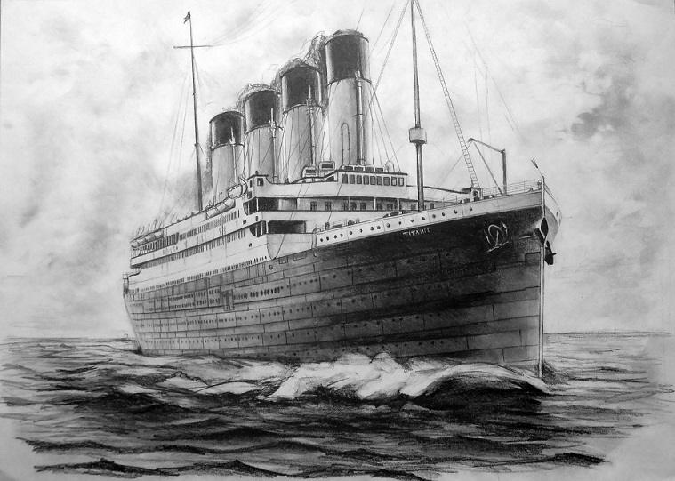

# Titanic Survival Prediction

This project demonstrates a basic example of using Logistic Regression to predict the survival of passengers on the Titanic. The dataset used is the Titanic dataset from Kaggle.

## Project Overview

The goal of this project is to build a Logistic Regression model to predict whether a passenger survived the Titanic disaster based on features such as age, gender, passenger class, and other factors. The following steps were taken to complete this project:

1. Data Loading
2. Exploratory Data Analysis (EDA)
3. Data Cleaning
4. Feature Engineering
5. Model Building
6. Model Evaluation

## Getting Started

### Prerequisites

Ensure you have the following Python libraries installed:

- pandas
- numpy
- matplotlib
- seaborn
- scikit-learn

You can install these libraries using pip:

~~~bash
pip install pandas numpy matplotlib seaborn scikit-learn
~~~

### Data

The dataset used in this project is `titanic_train.csv` which can be downloaded from Kaggle. Place the dataset in the same directory as the notebook.

### Running the Project

1. **Import Libraries:**

    ~~~python
    import pandas as pd
    import numpy as np
    import matplotlib.pyplot as plt
    import seaborn as sns
    %matplotlib inline
    from IPython.display import Image
    ~~~

2. **Load Data:**

    ~~~python
    train = pd.read_csv('titanic_train.csv')
    train.head()
    ~~~

3. **Exploratory Data Analysis (EDA):**

    - Check for missing data:
    
        ~~~python
        train.isnull().sum()
        sns.heatmap(train.isnull(), yticklabels=False, cbar=False, cmap='viridis')
        ~~~

    - Visualize data:

        ~~~python
        sns.set_style('whitegrid')
        sns.countplot(x='Survived', data=train)
        sns.countplot(x='Survived', hue='Sex', data=train, palette='RdBu_r')
        sns.countplot(x='Survived', hue='Pclass', data=train, palette='rainbow')
        sns.displot(train['Age'].dropna(), kde=False, color='darkred', bins=40)
        train['Age'].hist(bins=30, color='darkred', alpha=0.3)
        sns.countplot(x='SibSp', data=train)
        train['Fare'].hist(color='green', bins=40, figsize=(8,4))
        ~~~

4. **Data Cleaning:**

    - Impute missing Age values based on Pclass:

        ~~~python
        def impute_age(cols):
            Age = cols[0]
            Pclass = cols[1]
            if pd.isnull(Age):
                if Pclass == 1:
                    return 37
                elif Pclass == 2:
                    return 29
                else:
                    return 24
            else:
                return Age

        train['Age'] = train[['Age', 'Pclass']].apply(impute_age, axis=1)
        sns.heatmap(train.isnull(), yticklabels=False, cbar=False, cmap='viridis')
        ~~~

    - Drop Cabin column and rows with missing Embarked values:

        ~~~python
        train.drop('Cabin', axis=1, inplace=True)
        train.dropna(inplace=True)
        ~~~

5. **Feature Engineering:**

    - Convert categorical features to dummy variables:

        ~~~python
        sex = pd.get_dummies(train['Sex'], drop_first=True)
        embark = pd.get_dummies(train['Embarked'], drop_first=True)
        train.drop(['Sex', 'Embarked', 'Name', 'Ticket'], axis=1, inplace=True)
        train = pd.concat([train, sex, embark], axis=1)
        ~~~

6. **Model Building:**

    - Split data into training and test sets:

        ~~~python
        from sklearn.model_selection import train_test_split
        X_train, X_test, y_train, y_test = train_test_split(train.drop('Survived', axis=1), 
                                                            train['Survived'], test_size=0.30, 
                                                            random_state=101)
        ~~~

    - Train the model:

        ~~~python
        from sklearn.linear_model import LogisticRegression
        logmodel = LogisticRegression()
        logmodel.fit(X_train, y_train)
        ~~~

    - Make predictions:

        ~~~python
        predictions = logmodel.predict(X_test)
        ~~~

7. **Model Evaluation:**

    - Evaluate the model:

        ~~~python
        from sklearn.metrics import confusion_matrix, accuracy_score
        accuracy = confusion_matrix(y_test, predictions)
        print(accuracy)
        accuracy = accuracy_score(y_test, predictions)
        print(f'Accuracy: {accuracy}')
        ~~~

## Results

The model's accuracy score and confusion matrix can be found in the output of the evaluation steps above.

## Contributing

Feel free to fork this repository and submit pull requests. If you find any issues, please report them.

## License

This project is licensed under the MIT License - see the [LICENSE](LICENSE) file for details.

## Acknowledgments

- Kaggle for the Titanic dataset.
- The open-source community for the libraries used in this project.

